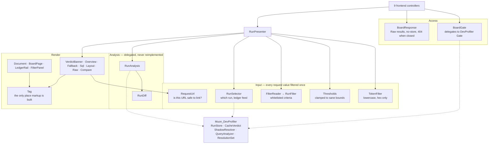

# Muon_DevProfilerBoard — Technical Reference

Module: `Muon_DevProfilerBoard` · Package `muon/module-dev-profiler-board` 1.0.0 · proprietary
Requires PHP `~8.3.0 || ~8.4.0 || ~8.5.0`, Magento 2.4.9, `muon/module-dev-profiler ^1.2`.

## Architecture

Four layers. Nothing here captures anything — the board is a read surface over a ring the profiler
already wrote.



## Routes

`etc/frontend/routes.xml` — `<route id="muon_profiler" frontName="muon_profiler">`. The underscore
in a front name follows core precedent (`magento_version`, `inventory_catalog`); the
namespace-separator hazard applies to controller **action** names, and no board action uses one.

| Route | Controller | Verb | Result | Content-Type |
|---|---|---|---|---|
| `/muon_profiler/` | `Controller/Index/Index.php` | GET | Raw | `text/html` |
| `/muon_profiler/run/view` | `Controller/Run/View.php` | GET | Raw | `text/html` |
| `/muon_profiler/run/json` | `Controller/Run/Json.php` | GET | Raw | `application/json` |
| `/muon_profiler/run/markdown` | `Controller/Run/Markdown.php` | GET | Raw | `text/plain` |
| `/muon_profiler/runs/feed` | `Controller/Runs/Feed.php` | GET | Raw | `application/json` |
| `/muon_profiler/runs/clear` | `Controller/Runs/Clear.php` | **POST** | Redirect | — |
| `/muon_profiler/compare/index` | `Controller/Compare/Index.php` | GET | Raw | `text/html` |
| `/muon_profiler/asset/stylesheet` | `Controller/Asset/Stylesheet.php` | GET | Raw | `text/css` |
| `/muon_profiler/asset/script` | `Controller/Asset/Script.php` | GET | Raw | `application/javascript` |

Every GET response carries `Cache-Control: no-store, private` and `X-Robots-Tag: noindex, nofollow`,
stamped once in `Model/Response/BoardResponse.php`.

`runs/clear` is the only state-changing route in the module. It implements `HttpPostActionInterface`
**and** `CsrfAwareActionInterface` with a real form-key check, and redirects afterwards so a refresh
cannot clear a second time.

### Query parameters

| Parameter | Read by | Filtered by |
|---|---|---|
| `token` | run view, json, markdown, compare (`a`, `b`) | `TokenFilter` — lowercased, then `[a-f0-9]` only |
| `panel` | run view | whitelist in `RunView::PANELS` |
| `nplus1`, `duplicate`, `slow` | run view, markdown | `Thresholds` — cast and clamped |
| `fallback`, `shadowed` | fallback panel | substring used only for `stripos`; flag is boolean |
| `url`, `verdict`, `method`, `status`, `min_ms`, `max_ms`, `min_stmt`, `max_stmt` | ledger, feed | `FilterReader` — whitelisted or clamped |
| `any` | run view | mirrors the CLI's `--any` |
| `limit` | runs feed | clamped to `feedLimit`, then to the ring size |
| `cleared` | index | integer only; drives the post-clear notice |

## Classes

### Access and response

| Class | Responsibility |
|---|---|
| `Model/Access/BoardGate.php` | Asks `Muon\DevProfiler\Model\Run\Gate::isProfiled()`. Deliberately does not re-test developer mode — two answers to "is profiling active" would eventually disagree |
| `Model/Response/BoardResponse.php` | Builds every `Result\Raw`, stamps headers, and returns the plain-text 404 when the gate is closed |
| `Model/Asset/AssetReader.php` | Serves `assets/board.css` / `assets/board.js` by logical name from a constant map. **No caller supplies a path** |

### Input

| Class | Responsibility |
|---|---|
| `Model/Run/TokenFilter.php` | Reduces a token to lowercase hex. Lowercases first, so a token copied from a heading still resolves |
| `Model/Run/RequestUrl.php` | Whether a recorded URL may be rendered as a link — refuses protocol-relative and schemed URLs |
| `Model/Analysis/Thresholds.php` | Reads and clamps `nplus1` / `duplicate` / `slow` |
| `Model/Run/RunFilter.php` | Immutable ledger criteria; `matches()`, `count()`, `toQuery()` |
| `Model/Run/FilterReader.php` | Builds a `RunFilter` from the query string, whitelisting and clamping every field |
| `Model/Run/RunSelector.php` | `select()` = newest **full document**; `selectAny()` = newest of any kind; `feed()` = ledger rows; `matching()` = how many in the ring match; `total()` = ring size |
| `Model/Board/RunPresenter.php` | Turns a request into a rendered page. The one place request values are read |

### Analysis

| Class | Responsibility |
|---|---|
| `Model/Analysis/RunAnalysis.php` | Calls `CacheVerdict`, `ShadowResolver` + `ResolutionSet`, and `QueryAnalyzer`, and returns their output plus totals |
| `Model/Run/RunDiff.php` | Compares two runs: verdict change with cause, scalar deltas, handle set difference, statement-shape deltas, and **fallback winner changes** |

### Rendering

`Model/Html/` — `Tag`, `Widgets`, `UrlBuilder`, `Document`, `BoardPage`, `LedgerRail`, `FilterPanel`,
`RunView`, `VerdictBanner`, `OverviewPanel`, `FallbackPanel`, `SqlPanel`, `LayoutPanel`, `RawPanel`,
`ComparePanel`. Plus `Model/Export/MarkdownExporter.php`.

## DI

`etc/frontend/di.xml`, frontend area only:

```xml
<type name="Muon\DevProfiler\Model\Run\RunFinalizer">
    <arguments>
        <argument name="excludedActions" xsi:type="array">
            <item name="board_index" xsi:type="string">muon_profiler_index_index</item>
            <!-- …one item per action reachable through routes.xml — nine in total… -->
        </argument>
    </arguments>
</type>

<type name="Muon\DevProfilerBoard\Model\Run\RunSelector">
    <arguments>
        <argument name="feedLimit" xsi:type="number">25</argument>
    </arguments>
</type>
```

**No plugins, no preferences, no observers.** Intercepting anything in `Muon_DevProfiler`'s
constructor graph makes the object manager generate an interceptor inside `___callPlugins()`, which
is the documented cause of the `Undefined array key "Magento\Framework\App\Http"` failure that took
the storefront down in that module's 1.0.0 — and it is invisible whenever `generated/` is populated.

## Surfaces this module does not have

No `system.xml`, `acl.xml`, `db_schema.xml`, `webapi.xml`, `schema.graphqls`, `crontab.xml`,
`events.xml`, `@api` annotation, or database access of any kind. It issues **zero** SQL statements —
`getConnection`, `ResourceConnection`, `Zend_Db` and `->query(` return no hits across the module.

## The three invariants

Verified mechanically in review, not by inspection, because each fails silently.

### 1. Theme independence

No `layout/*.xml`, no `.phtml`, no `view/`, no `web/`, no `View\Element\Template`,
`View\Result\PageFactory` or `Result\Page`, and no theme package in `composer.json`. The rendered
document contains no `requirejs`, `x-magento-init`, `data-mage-init`, `pub/static` or
`/static/version` reference.

The closed-gate path is included: a 404 is a plain-text `Result\Raw`, not a `forward('noroute')`,
which would have rendered a themed CMS page on the one path nobody tests.

`Test/Unit/Model/Html/DocumentTest.php` asserts this at the document level, so a future refactor to
blocks and templates fails a test rather than passing review.

### 2. Self-exclusion completeness

All **nine** actions reachable through `routes.xml` appear in the `excludedActions` contribution. The
two lists are diffed item by item during review, and confirmed at runtime: browsing the board leaves
the ring unchanged, and no board response carries an `X-Muon-Profile` header.

### 3. Escaping

No run-derived value reaches markup outside `Model/Html/Tag.php`.

A stored run holds the request URL, and **the request URL is attacker-controlled**. Rendering it raw
would be stored XSS against the developer, on an instance that by definition has developer mode on.

`Tag` also owns the URL/attribute distinction. `href`, `src` and `action` are escaped with
`escapeUrl()` **and nothing else**, because Magento's `escapeUrl()` already applies
`escapeHtmlAttr()` internally — escaping twice turns the `&` between query parameters into
`&amp;amp;`, which a browser decodes to a literal `&amp;`, and every threshold and filter control on
the board silently stops working while the page still looks correct.

Linking a recorded URL is a stronger claim than displaying one, so `RequestUrl` gates it separately:
only a single-slash root-relative path becomes an `href`. `//evil.example/x` is recorded verbatim,
escapes cleanly, and as an href is protocol-relative — it is shown as text and never linked.

`Test/Unit/Model/Html/XssRegressionTest.php` feeds a payload through every panel in every field and
asserts the output is inert. It has been verified to fail when the escaping is removed.

## Ledger filters

Six criteria — URL, verdict, method, status, execution-time range, statement-count range — read by
`FilterReader` into an immutable `RunFilter`, rendered by `FilterPanel`, applied in
`RunSelector::feed()`.

**Filtering runs over the whole ring, not over the rows the ledger fetched.** The ledger is capped at
`feedLimit`; filtering the fetched page would let "show me the uncacheable runs" come back empty
while matches sat below the cut — a filtered list presenting itself as a complete answer.
`feed()` therefore reads `RunStore::count()` runs when a filter is active and caps afterwards, and
`matching()` counts across the whole ring so the summary can say "11 of 33 runs match".

The live poll carries the same criteria, so a refresh cannot repopulate the ledger with rows the
reader just filtered out.

URL matching is a case-insensitive substring of the whole recorded URI including its query string —
the same rule `FallbackPanel`'s "Path contains" uses. It is a haystack search, never a pattern.

## State in the query string

Every piece of view state — the open panel, the analysis thresholds, the fallback filters, the ledger
criteria — lives in the URL. Two consequences the code depends on:

- **Any view of the board is a shareable link.**
- **A panel's own form states its own panel** (`FallbackPanel::PANEL`, `SqlPanel::PANEL`) rather than
  echoing request state. Tab switching is client-side and does not put `panel` in the URL, so on the
  default view the value is absent and a state-carried submit would bounce the reader to Overview.
  `assets/board.js` also writes the open panel into the URL with `history.replaceState` and rewrites
  the ledger hrefs, so the two layers fail independently rather than together.

## Performance

- No entity loading, no N+1 risk — the board reads JSON files.
- The ledger feed, which a browser polls every 4 s, decodes at most `feedLimit` files (or the ring
  when filtered) and asks `CacheVerdict` for a status. It never runs `ShadowResolver` (which stats
  candidate directories) or `QueryAnalyzer`.
- `RunStore::count()` counts ring files without decoding any of them, so the header counter and the
  filter summary do not pay to unserialize fifty documents to print two integers.
- Polling is suspended when the tab is hidden (`document.visibilityState`).
- Measured: a run view with 99 fallback resolutions and 160 statements renders in **78 ms**.

## Testing

`Test/Unit/` — 18 test classes, **181 tests, 379 assertions**, **83.9%** line coverage across
`Model/`.

Four classes carry no unit coverage, all composition rather than logic: `RunView`, `RunPresenter`,
`BoardResponse`, `BoardPage`. They are exercised end-to-end by the headless browser drivers in
`src/var/board-*.mjs`.

## Screenshots to capture

| Navigation | Suggested filename |
|---|---|
| `/muon_profiler/` — Overview panel, dark | `docs/screenshots/board-overview.png` |
| `/muon_profiler/?url=trade&verdict=miss` — filter panel | `docs/screenshots/board-filter.png` |
| `/muon_profiler/run/view?panel=fallback&shadowed=1` — shadow ladders | `docs/screenshots/board-fallback.png` |
| `/muon_profiler/run/view?panel=sql` — N+1 findings | `docs/screenshots/board-sql.png` |
| `/muon_profiler/compare/index?a=…&b=…` | `docs/screenshots/board-compare.png` |
